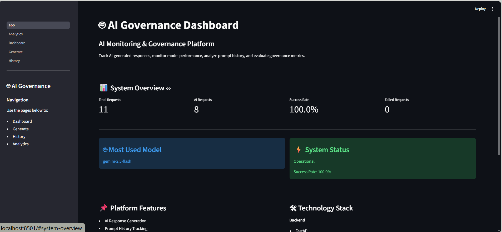
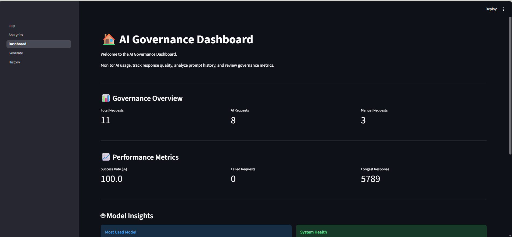
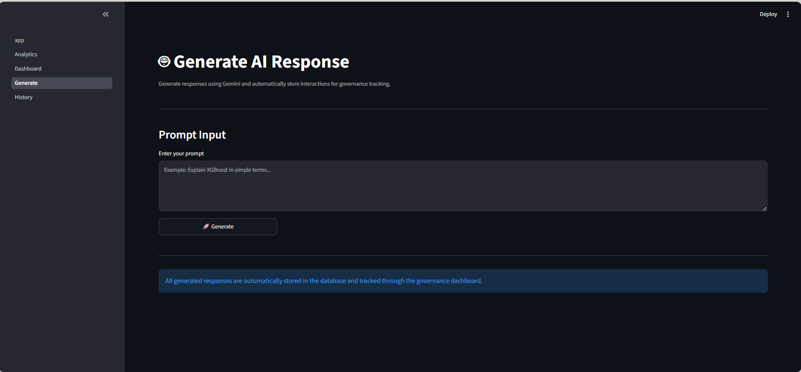
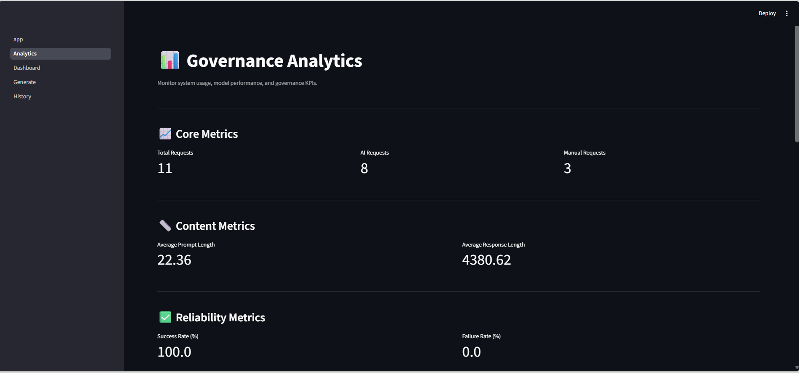
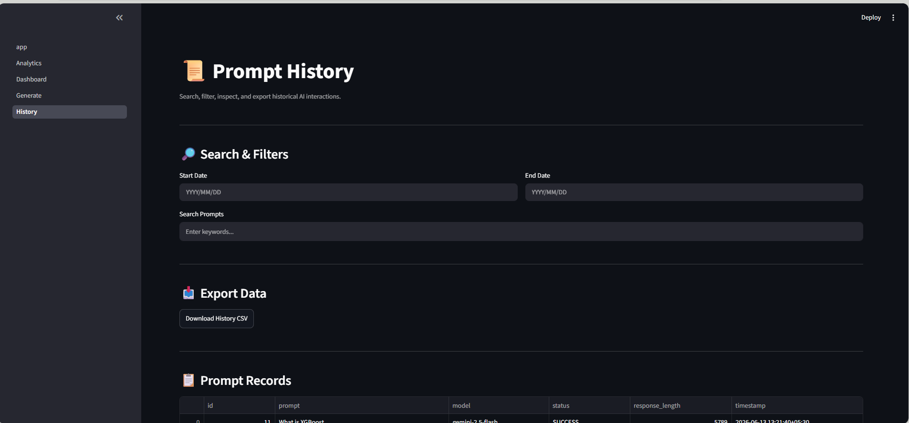

# AI Governance Dashboard

## Overview

AI Governance Dashboard is a full-stack AI monitoring and governance platform built using FastAPI, PostgreSQL, Streamlit, and Google's Gemini API.

The platform enables users to generate AI responses, store interactions, monitor model performance, analyze prompt history, and track governance metrics through an interactive dashboard.

## Features

### AI Response Generation

* Gemini 2.5 Flash integration
* Prompt and response storage
* Response tracking and monitoring

### Prompt History

* Search functionality
* Date filtering
* Detailed prompt inspection
* CSV export

### Analytics

* Request monitoring
* Success and failure tracking
* Average prompt length
* Average response length
* Model usage analytics

### Dashboard KPIs

* Total Requests
* AI Requests
* Manual Requests
* Success Rate
* Failed Requests
* Most Used Model
* Longest Response
* Latest Prompt

## Tech Stack

### Backend

* FastAPI
* SQLAlchemy
* PostgreSQL
* Gemini API

### Frontend

* Streamlit

### Database

* PostgreSQL

## Project Structure

```text
AI-Governance-Dashboard/
│
├── backend/
│   ├── database/
│   ├── routes/
│   ├── schemas/
│   └── services/
│
├── frontend/
│   ├── app.py
│   └── pages/
│
├── assets/
├── requirements.txt
└── README.md
```

## Screenshots

### Home Page



### Dashboard



### Generate Response



### Analytics



### Prompt History



## Installation

### Clone Repository

```bash
git clone https://github.com/teja2704/AI-Governance-Dashboard.git

## Install Dependencies
pip install -r requirements.txt
Start Backend
uvicorn backend.main:app --reload
Start Frontend
streamlit run frontend/app.py

## Future Enhancements

* Authentication & Authorization
* PDF Report Generation
* Docker Deployment
* Cloud Deployment
* Multi-Model Support
